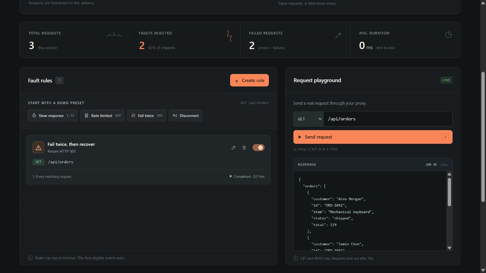

# FaultDeck

**在本地制造故障，让上线更有把握。**

带可视化控制面板的 HTTP 故障代理，可以本机运行，也可以部署为带认证和规则持久化的服务。把应用的请求指向 FaultDeck，点击按钮模拟慢响应、错误码、超时或连接中断，检查你的异常处理是否真的有效。

[English](README.md) · [下载](https://github.com/ogrtdtghkhan-afk/faultdeck/releases/latest) · [反馈问题](https://github.com/ogrtdtghkhan-afk/faultdeck/issues)

[部署真实可用的服务](docs/deployment.zh-CN.md) · [浏览器交互演示](https://ogrtdtghkhan-afk.github.io/faultdeck/)（模拟）

[](https://github.com/ogrtdtghkhan-afk/faultdeck/actions/workflows/ci.yml)

```text
你的应用 ──► localhost:7332 ──► 原来的后端
                    ▲
             FaultDeck 控制面板
              localhost:7331
```

- **点击制造故障**：增加延迟、返回 429/503、模拟超时或断开连接。
- **先失败，再恢复**：每隔 N 次匹配请求注入一次故障，也可以只注入前两次。
- **看清请求发生了什么**：查看请求路径、命中规则、状态码和耗时。
- **场景可以进版本库**：导出 JSON，通过命令行或页面重新加载。
- **自带演示 API**：订单、商品、健康检查和 SSE，无需 API Key 或数据集。
- **一个可执行文件**：内嵌页面，Go 标准库实现，无需账号、额外服务或前端构建步骤。



## 使用 Docker 部署

部署可以代理真实请求的控制台与服务，包含认证和规则持久化：

```sh
git clone https://github.com/ogrtdtghkhan-afk/faultdeck.git
cd faultdeck
cp .env.example .env
```

PowerShell 将最后一行替换为 `Copy-Item .env.example .env`。在 `.env` 中给 `FAULTDECK_ADMIN_PASSWORD` 设置至少 12 个字符的自选随机密码，然后启动：

```sh
docker compose up --build -d
docker compose ps
```

服务 healthy 后打开 **http://127.0.0.1:7331**，使用 `admin` 和自设密码登录，在 UI 设置真实上游。应用请求 **http://127.0.0.1:7332** 时携带 `X-FaultDeck-Token`；未单独设置令牌时使用管理员密码。命名卷会保存配置和规则，重建容器后仍可使用。

宿主机/容器网络、远程访问、认证、持久化和真实容器验收见[中文部署指南](docs/deployment.zh-CN.md)。请使用当前源码仓库，旧版 v0.1.0 压缩包尚不包含这套部署文件。

## 体验本机可执行文件

想直接验证客户端重试？查看 [Node.js 自动重试和 Vite 接入示例](docs/integrations.md)，运行真实的 **503 → 503 → 200** 恢复流程。

从 [Releases](https://github.com/ogrtdtghkhan-afk/faultdeck/releases/latest) 下载适合你的系统和架构的压缩包并解压。在解压得到的 `faultdeck_<版本>_<系统>_<架构>` 文件夹中打开终端（确认当前文件夹包含可执行文件），然后运行：

```powershell
# Windows PowerShell
.\faultdeck.exe
```

```sh
# macOS / Linux
./faultdeck
```

打开 **http://127.0.0.1:7331**。首次使用且没有配置目标时，程序默认连接内置演示 API；之后会从 `./data` 恢复保存的上游和规则。

1. 在请求试验区向 `/api/orders` 发起一次请求，观察正常结果。
2. 添加 **Fail twice** 预设，连续发起三次请求。
3. 在活动记录中查看 `503`、`503`，然后恢复为上游的正常响应。

试验区会向当前配置的上游发起真实请求。首次体验建议使用内置演示；下载完成后，演示可离线运行。本机可执行文件默认仅回环访问，可通过下文环境变量开启认证；部署服务请使用 Docker 说明。

### 从源码运行

需要 Go 1.24 或更高版本。

```sh
git clone https://github.com/ogrtdtghkhan-afk/faultdeck.git
cd faultdeck
go run ./cmd/faultdeck
```

## 接入自己的应用

假设后端监听 8000 端口：

```sh
./faultdeck --target http://127.0.0.1:8000
```

Windows 下将命令中的 `./faultdeck` 换成 `.\faultdeck.exe`。

把应用在开发环境下的 API 基础地址改为 `http://127.0.0.1:7332`。开启代理认证后，请携带配置的 `X-FaultDeck-Token`；业务自己的 `Authorization` 会保留。然后打开控制面板，给目标接口添加规则，正常操作你的应用即可。

上游支持 HTTP、HTTPS 和基础路径；本地代理入口使用 HTTP。HTTPS 网页直接访问它可能受到浏览器混合内容限制，可通过开发服务器的代理接入。FaultDeck 保留上游的 CORS 行为，不会自动放开跨域访问。

本机控制台和代理默认绑定 `127.0.0.1`，可通过 `--listen` 调整；远程绑定必须启用认证。内置演示仍在回环地址监听。Docker 默认也只发布宿主机回环端口，跨容器网络和远程访问见[部署指南](docs/deployment.zh-CN.md)。

## 四种故障

| 类型 | 实际行为 | 适用场景 |
| --- | --- | --- |
| Latency 延迟 | 等待指定时间后正常转发 | 加载状态、慢网络 |
| Status 错误码 | 直接返回 400–599 状态，不访问上游 | 登录失败、限流、重试 |
| Timeout 超时 | 等待指定时间；客户端仍连接时返回 504 | 客户端超时、超时提示 |
| Disconnect 断连 | 不返回 HTTP 响应，关闭连接，不访问上游 | 网络异常处理 |

Timeout 是有时限的模拟，不会永久挂起连接。要测试客户端自己的超时，请让故障等待时长大于客户端超时时长。内置请求试验区本身有 10 秒截止时间。

### 规则匹配与计数

- 请求方法支持具体方法或 `*`。路径支持完全匹配、`*`，以及 `/api/*` 这样的末尾通配前缀。
- 按页面中的顺序检查规则，**第一条满足注入条件的规则生效**，不会叠加故障。
- `every: 1` 表示每次匹配都注入；`every: 3` 表示第 3、6、9 次匹配时注入。
- `limit: 2` 表示最多注入两次，之后交给后续规则或上游；`limit: 0` 表示不限次数。
- 只有执行到某条启用的规则且方法、路径匹配时，它的匹配计数才增加。被前面的规则处理的请求不会推进后面规则的计数。
- 编辑规则会清零该规则计数。Reset 会清空所有规则计数、统计和请求记录，保留配置及规则。

例如，`every: 1, limit: 2, type: "status", statusCode: 503` 表示“前两次返回 503，之后恢复”；`every: 2, limit: 2` 则在第 2 和第 4 次匹配请求时注入。

## 保存并复用场景

在页面导入、导出 JSON，也可以启动时加载示例：

```sh
./faultdeck --scenario examples/fail-twice.json
```

```json
{
  "version": 1,
  "name": "Fail twice, then recover",
  "upstream": "http://127.0.0.1:7333",
  "enabled": true,
  "rules": [
    {
      "name": "Orders recover after two failures",
      "enabled": true,
      "method": "GET",
      "path": "/api/orders",
      "type": "status",
      "statusCode": 503,
      "every": 1,
      "limit": 2
    }
  ]
}
```

示例使用演示 API 的默认端口 7333。另有[慢订单接口](examples/slow-orders.json)、[每三次限流一次](examples/rate-limit.json)、[超时](examples/timeout.json)和[断连一次](examples/disconnect-once.json)。导出的文件不含运行计数，重新导入时从零开始。

场景包含上游地址和规则路径，分享前请检查是否有私有域名或业务标识。导入场景会更新目标配置，发送请求前确认页面显示的上游地址。

## 命令行参数

| 参数 | 默认值 | 用途 |
| --- | --- | --- |
| `--target` | 已保存目标，否则内置演示 | 显式覆盖上游 HTTP(S) 地址 |
| `--listen` | `127.0.0.1` | 控制台和代理的监听地址 |
| `--port` | `7332` | 代理端口 |
| `--ui-port` | `7331` | 控制面板端口 |
| `--demo-port` | `7333` | 内置演示端口 |
| `--data-dir` | `./data` | 保存配置与规则；`--data-dir=` 关闭持久化 |
| `--ui-origin` | 本机控制台 origin | 浏览器访问的协议、主机及端口 |
| `--proxy-url` | 本机代理 origin | 展示给应用的代理地址 |
| `--scenario` | 无 | 启动时加载场景 JSON |
| `--healthcheck` | — | 检查内部控制监听，成功/失败退出 0/1 |
| `--version` | — | 输出版本后退出 |

场景文件已包含上游地址，因此 `--target` 与 `--scenario` 不能同时使用。完整参数见 `--help`，编程控制见 [HTTP API 说明](docs/api-contract.md)。

认证通过环境变量配置：`FAULTDECK_ADMIN_USER` 默认 `admin`；设置至少 12 个字符的 `FAULTDECK_ADMIN_PASSWORD` 开启 Basic Auth；`FAULTDECK_PROXY_TOKEN` 可单独设置至少 12 个字符的代理令牌，留空时使用管理员密码。远程访问必须设置管理员密码，随附 Compose 即使只发布宿主机本地端口也要求设置。

## 使用边界与持久化数据

v0.2 支持本机和容器部署，面向开发、测试阶段的 HTTP 请求故障。SSE 仅透传，不支持逐事件修改或延迟；不保证 WebSocket 行为。本项目不是 TCP 流量整形工具、HTTPS 中间人代理或压测服务。

上游地址、故障总开关和规则会保存到数据目录。本机默认使用 `./data`，Docker 使用 `/data` 数据卷。运行计数和活动记录不持久化，服务重启后从零开始。

最近 200 条请求记录仅保存在内存，包含方法、路径、状态、耗时及故障信息，不记录请求或响应正文、请求头、查询字符串。试验区会展示最多 64 KiB 的响应内容。路径本身仍可能含敏感标识。

控制 API 校验配置的来源，修改操作要求 `X-FaultDeck: 1`。启用认证后，控制台和管理 API 使用 Basic Auth，业务代理要求 `X-FaultDeck-Token`，并在转发前移除该令牌。`/healthz` 是不要求认证的最小健康检查入口。SSH 访问和带认证的 HTTPS 反向代理配置见[部署指南](docs/deployment.zh-CN.md)，安全边界和漏洞反馈见 [SECURITY.md](SECURITY.md)。

## 开发

```sh
go test ./...
go vet ./...
go build ./cmd/faultdeck
```

有兼容 C 编译器时，可运行 `go test -race ./...`。仓库包含 Go 1.24 与 stable 的 Linux、Windows、macOS CI，以及 Linux 竞态检查。版本标签触发各平台 `amd64`、`arm64` 压缩包构建，并生成 SHA-256 校验文件。

欢迎提交可复现的问题、实用的故障场景和文档改进。贡献方式见 [CONTRIBUTING.md](CONTRIBUTING.md)。

## 许可证

[MIT](LICENSE)。
